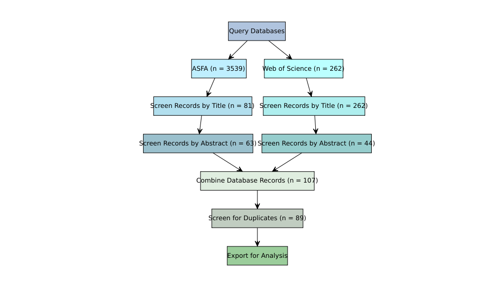

Paper Review Overview Document
================

## Review Process

Papers collected via the search strings laid out in the ‘search
structure’ document were filtered using the ‘revtools’ package in R. The
script ‘Dreissenid\_paper\_review\_R\_script’ represents the full
filtering routine with annotations for transparency and replicability.

<!-- -->
\#\# Analysis and Results of Review

The above figure, taken from the pre-established search protocol in the
‘search structure’ document, shows the results for each of the steps of
filtering papers.

Papers were evaluated at the title and then the abstract level for
meeting the following criteria in sequential order:

> \[1.\] Zebra/quagga mussels topic of exploration? Y/N, yes include

> \[2.\] North American range? North American included

> \[3.\] Observational, modeling or experimental? Observational included

> \[4.\] Does it discuss correlates of distribution? Y/N, yes included

Failure to meet any of the criteria would result in the paper being
excluded from the analysis. At the abstract level, the stage at which a
paper failed to meet a criterion was noted within the review sheet and
replicated here seperately for the ASFA and WoS searches.

Database records were combined together after filtering and screened for
duplicates before being exported for analysis.
