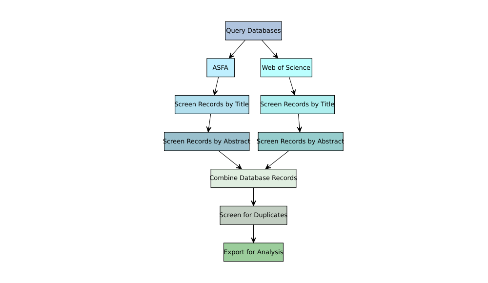

Correlate Search Structure Document
================

## Search Parameters and Justification

The search parameters for the literature search for the environmental
correlates for dreissenid mussels are as follows:

> (mussel\* AND (dreissen\* OR zebra OR quagga) AND (invas\* OR
> non-native OR introduc*)) AND (habitat OR environment* OR niche) AND
> (suitability OR requirement\* OR limit\*)

This query was designed to capture both species of interest ( *Dreissena
polymorpha* and *Dreissena rostriformis bugensis*), as well as potential
synonyms for invasion. The second line of the query as presented here
functions to capture papers that evaluate the habitat of dreissenid
mussels and their potential suitability for their establishment and
persistence.

## Search Structure and Databases

<!-- -->

The above review process will be used for both parallel literature
searches. Titles will be retrieved from .bib files extracted from each
database and analyzed using the ‘revtools’ package. Titles will first be
screened by title and then abstract using the following criteria:

> \[1.\] Zebra/quagga mussels topic of exploration? Y/N, yes include

> \[2.\] North American range? North American included

> \[3.\] Observational, modeling or experimental? Observational included

> \[4.\] Does it discuss correlates of distribution? Y/N, yes included

Each paper will be evaluated against the above criteria in sequential
order - a failure to meet any of the criteria will result in an
exclusion from the search. Failure to meet the search criteria as well
as which criteria were failed will be noted in each paper’s entry in the
analysis files for transparency.
